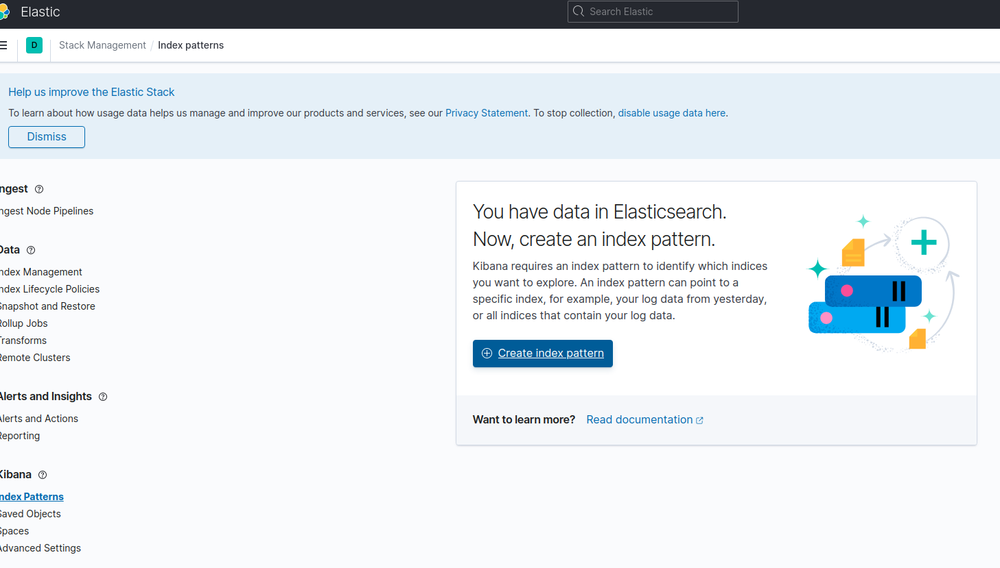
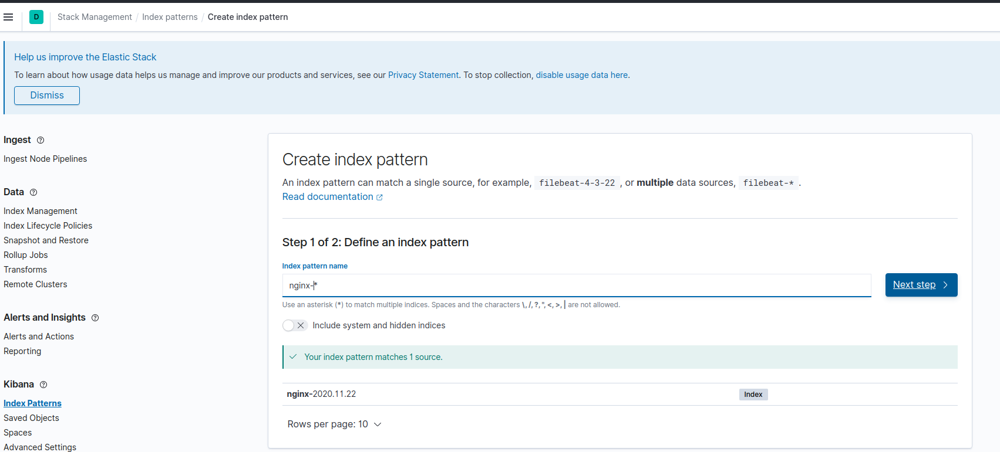
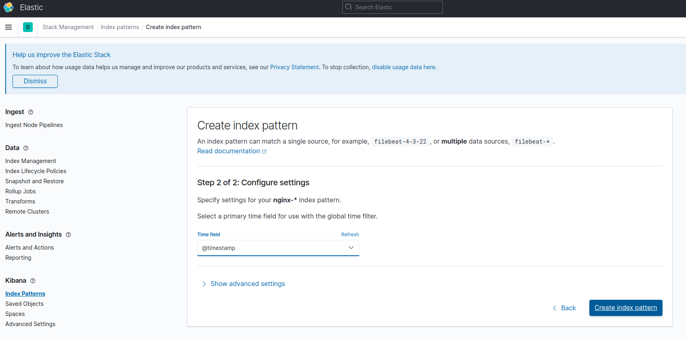
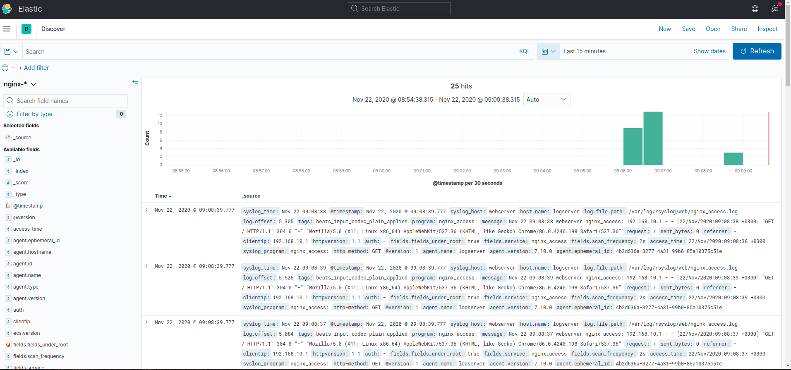

# Настраиваем центральный сервер для сбора логов
в вагранте поднимаем 2 машины web и log
на web поднимаем nginx
на log настраиваем центральный лог сервер на любой системе на выбор
- journald
- rsyslog
- elk
настраиваем аудит следящий за изменением конфигов нжинкса

все критичные логи с web должны собираться и локально и удаленно
все логи с nginx должны уходить на удаленный сервер (локально только критичные)
логи аудита должны также уходить на удаленную систему

* развернуть еще машину elk
и таким образом настроить 2 центральных лог системы elk И какую либо еще
в elk должны уходить только логи нжинкса
во вторую систему все остальное

########################################################################

Поднимем 3 сервера:
- webserver 192.168.10.10
- logserver 192.168.10.11
- и elkserver 192.168.10.12

# webserver 192.168.10.10

на webserver устанавливаем:
- nginx - веб-сервер, за которым будем следить
- rsyslog - утилита для сбора и обработки логов
- audispd-plugins - чтобы логи писались на удаленный сервер
Пакет auditd  уже есть в составе Centos7

в конфигурации nginx прописываем:
- Все критические логи сохраняем на локальной машине
error_log /var/log/nginx/error.log crit;
- Все остальные ошибки передаем на ip адрес logserver
error_log syslog:server=192.168.10.11:514,tag=nginx_error;
- Все события доступа также отправляем на ip адрес logserver
access_log syslog:server=192.168.10.11:514,tag=nginx_access;

Описываем формат лога

      log_format  main  '$remote_addr - $remote_user [$time_local] "$request" '
      '$status $body_bytes_sent "$http_referer" '
      '"$http_user_agent" "$http_x_forwarded_for"';

В /etc/audit/auditd.conf
       прописываем write_logs = no # чтобы логи не писались локально, а только на удаленный сервер

В правила аудита /etc/audit/rules.d/audit.rules прописываем отслеживать действия с конфигом, направленные на его изменения:

      -w /etc/nginx/nginx.conf -p wa -k nginx_conf
      -w /etc/nginx/default.d/ -p wa -k nginx_conf

В /etc/audisp/audisp-remote.conf указываем куда передаем логи

    - remote_server = 192.168.1.11
      port = 514
      active = yes

В /etc/rsyslog.conf	прописываем правила адресации для критических событий

     *.crit action(type="omfwd" target="192.168.1.11" port="514" protocol="tcp"

##############################################################

# logserver 192.168.1.11
Пакеты для установки:
- audispd-plugins
- auditd
- filebeat
- rsyslog

сервере log разрешить прием логов в файле /etc/rsyslog.conf:

        # Provides UDP syslog reception
	$ModLoad imudp
	$UDPServerRun 514

	# Provides TCP syslog reception
	$ModLoad imtcp
	$InputTCPServerRun 514

и правила для разделения логов nginx_access и nginx_error по отдельным директориям в /etc/rsyslog.conf доавлены следующие правила:

       if ($hostname == 'webserver') and ($programname == 'nginx_access') then {
       action(type="omfile" file="/var/log/rsyslog/webserver/nginx_access.log")
       stop
       }

       if ($hostname == 'webserver') and ($programname == 'nginx_error') then {
       action(type="omfile" file="/var/log/rsyslog/webserver/nginx_error.log")
       stop
       }

filebeat нужен для отправки логов на 3й сервер - elkserver
filebeat берем из репозитория elasticsearch
В конфиге filebeat указываем параметры отправки логов nginx на сервер elkserver /etc/filebeat/filebeat.yml

       filebeat.inputs:
       - type: log
         enabled: true
         paths:
           - /var/log/rsyslog/webserver/nginx_access.log
         fields:
           service: nginx_access
           fields_under_root: true
           scan_frequency: 2s

       - type: log
         enabled: true
         paths:
           - /var/log/rsyslog/webserver/nginx_error.log
         fields:
           service: nginx_error
           fields_under_root: true
           scan_frequency: 2s

       output.logstash:
         hosts: ["192.168.10.12:5044"]

##################################################################

# elkserver 192.168.1.12

ELK подразумевает установку 3-х продуктов:  Elasticsearch, Logstash и Kibana. Чтобы Elasticsearch работал потребуется установка  JVM (java-1.8.0) и увеличение производительности сервера, за счет  памяти и CPU. В Vagrant файле прописываем параметры:
      v.memory = 4096
      v.cpus = 2

В опциях elastica прописываем параметры для JVM (https://www.elastic.co/guide/en/elasticsearch/reference/current/jvm-options.html)
/etc/elasticsearch/jvm.options
    
       -Xms1g
       -Xmx1g

Для конфигурации Logstash используем три конфига:
файл конфигурации с именем 02-beats-input.conf ввод данных Filebeat:

       input {
           beats {
        host => "192.168.10.12"
        port => "5044"
           }
       }

файл конфигурации для вывода нужных данных по nginx 20-output.conf

       output {
           if [fields][service] == "nginx_access" {
        elasticsearch {
            hosts => "localhost:9200"
            index => "nginx-%{+YYYY.MM.dd}"
        }
           }
           if [fields][service] == "nginx_error" {
               elasticsearch {
            hosts => "localhost:9200"
            index => "nginx-%{+YYYY.MM.dd}"
               }
           }
       }

файл конфигурации для фильтрации событий nginx 10-nginx-filter.conf

       filter {
           if [fields][service] == "nginx_access" {
        grok {
            match => { "message" => "%{SYSLOGTIMESTAMP:syslog_time} %{SYSLOGHOST:syslog_host}+ %{SYSLOGPROG:syslog_program} %{IPORHOST:clientip} %{DATA:user} %{DATA:auth} \[%{HTTPDATE:access_time}\] \"%{WORD:http-method} %{URIPATHPARAM:request} HTTP/%{NUMBER:httpversion}\" %{NUMBER:response_code} %{NUMBER:sent_bytes} \"%{DATA:referrer}\" \"%{DATA:agent}\"" }
        }
    } 
    
    else if [type] == "nginx_error" {
        grok {
            match => { "message" => "%{SYSLOGTIMESTAMP:syslog_time} %{SYSLOGHOST:syslog_host}+ %{SYSLOGPROG:syslog_program} (?<timestamp>%{YEAR}[./-]%{MONTHNUM}[./-]%{MONTHDAY}[- ]%{TIME}) \[%{LOGLEVEL:severity}\] %{POSINT:pid}#%{NUMBER:tid}: %{GREEDYDATA:errormessage}, client: (?<client>%{IP}|%{HOSTNAME}), server: (?<server>%{IP}|%{USERNAME}), request: %{QS:request}, host: %{QS:host}" }
        }
    }

    date {
          match => [ "timestamp" , "dd/MMM/YYYY:HH:mm:ss Z" ]
    }
}

По итогу, проверяем статусы индексов и базы на elkserver

       curl -XGET localhost:9200/_cat/indices?v
       curl -XGET localhost:9200/_cat/health?v

####################################################################

# Проверка:

- Выполнить: vagrant up
- Выполнить несколько раз http://192.168.10.10 и http://192.168.10.10/error_page
чтобы у нас появились данные в логах.
- зайти на webserver и проверить, что логи nginx не сохраняются в /var/log/nginx кроме критических.
- зайти на logserver и убедиться, что логи nginx с webserver попали в /var/log/rsyslog/web/nginx_access.log и  /var/log/rsyslog/web/nginx_error.log соответственно
- Открыть dashboard kibanа (elkserver) на 192.168.10.12:5601 на вкладке Discover, создайте новый индекс шаблон nginx-*. и снова перейти на Discover 

# Материалы:

https://linux-notes.org/ustanovka-elk-elasticsearch-logstash-kibana-v-unix-linux/
https://ruhighload.com/%D0%9B%D0%BE%D0%B3%D0%B8+error_log+%D0%B8+access_log+%D0%B2+nginx
https://www.elastic.co/guide/en/beats/filebeat/current/setup-repositories.html
https://serveradmin.ru/ustanovka-i-nastroyka-elasticsearch-logstash-kibana-elk-stack/
https://www.digitalocean.com/community/tutorials/how-to-install-elasticsearch-logstash-and-kibana-elastic-stack-on-ubuntu-18-04-ru
https://habr.com/ru/post/451264/
https://codex.so/elastic-search
https://access.redhat.com/documentation/en-us/red_hat_enterprise_linux/7/html/security_guide/sec-defining_audit_rules_and_controls

